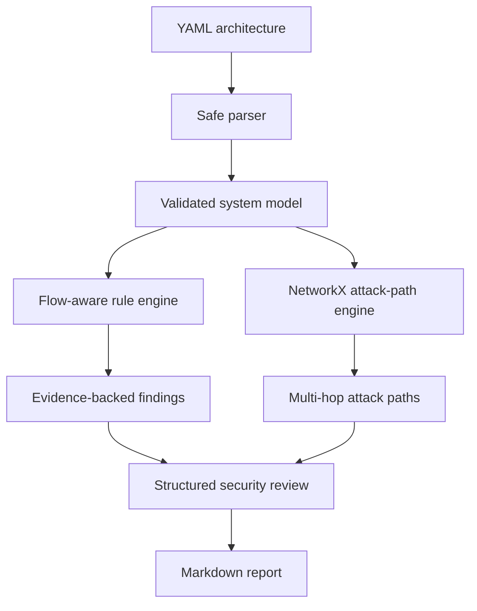

# ArchSec Reviewer

A security architecture analysis engine for cloud-native, distributed, and AI-enabled systems.

> Model trust transitions, discover attack paths, and generate evidence-backed security findings.

ArchSec Reviewer converts a structured architecture definition into a security review containing:

- Components, assets, trust zones, and data flows
- Flow-specific security findings
- Multi-hop attack paths
- Trust-boundary transitions
- Finding severity and confidence
- Supporting architecture evidence
- Recommended security controls
- Validation procedures
- Markdown security reports

## Why ArchSec Reviewer?

Traditional threat-model reports often depend on manually interpreting diagrams and architecture documents. Generic LLM-generated reviews can also produce plausible threats without showing whether the architecture actually supports those conclusions.

ArchSec Reviewer separates architecture evidence from security reasoning.

A finding is generated from an explicit relationship:

```text
LLM → Refund Tool
```

rather than from the words `LLM` and `tool` merely appearing in the same document.

The goal is not to make an AI model the security authority. The goal is to build a deterministic security-analysis foundation that can later use guarded AI assistance.

## Analysis Pipeline



## Current Capabilities

### Structured Architecture Model

ArchSec Reviewer models:

- Components
- Component types
- Trust zones and trust levels
- Assets and data classifications
- Directed data flows
- Authentication and encryption state
- Privileges and data handled
- Security objectives
- Architecture assumptions

### Flow-Aware Security Analysis

Rules are evaluated against directed relationships, including:

- User input reaching an LLM
- Retrieved content entering an LLM context
- LLM output reaching executable tools
- Unauthenticated cross-zone communication
- Unencrypted cross-zone communication

### Evidence-Backed Findings

Each finding includes:

- Stable finding ID
- Threat category
- Attack scenario
- Severity
- Confidence
- Affected components
- Supporting evidence
- Assumptions
- Recommended controls
- Validation steps
- Optional standards references

### Graph-Based Attack Paths

NetworkX is used to:

- Build a directed architecture graph
- Identify untrusted entry points
- Identify privileged and sensitive targets
- Discover multi-hop paths
- Limit path depth
- Handle graph cycles safely
- Preserve flow IDs as evidence
- Record trust-zone transitions

### Safe YAML Processing

Structured input uses:

- `yaml.safe_load()`
- A 1 MB input limit
- UTF-8 validation
- Required-field validation
- Enum validation
- Component-reference validation
- Duplicate-ID detection
- Rejection of unsafe Python object tags

## Installation

Clone the repository:

```bash
git clone https://github.com/khirawdhi/archsec-reviewer.git
cd archsec-reviewer
```

Create and activate a virtual environment:

```bash
python3 -m venv .venv
source .venv/bin/activate
```

Install ArchSec Reviewer:

```bash
python -m pip install -e .
```

For development:

```bash
python -m pip install -e ".[dev]"
```

## Quick Start

Generate a structured review:

```bash
archsec-review \
  --input examples/rag-system.yaml \
  --output reports/rag-security-review.md
```

The YAML extension selects the structured analysis pipeline automatically.

Preview the generated report:

```bash
sed -n '1,120p' reports/rag-security-review.md
```

## Example Architecture

```yaml
name: Tool-Using Assistant

trust_zones:
  - id: internet
    name: Internet
    trust_level: untrusted

  - id: ai
    name: AI Runtime
    trust_level: internal

  - id: privileged
    name: Privileged Operations
    trust_level: privileged

components:
  - id: user
    name: Customer
    type: user
    trust_zone: internet

  - id: llm
    name: Support LLM
    type: llm
    trust_zone: ai

  - id: refund_tool
    name: Refund Tool
    type: tool
    trust_zone: privileged

assets:
  - id: refund_capability
    name: Refund Capability
    classification: restricted
    owner_component: refund_tool

data_flows:
  - id: user_to_llm
    source: user
    destination: llm
    authenticated: true
    encrypted: true

  - id: llm_to_refund
    source: llm
    destination: refund_tool
    authenticated: true
    encrypted: true

security_objectives:
  - Prevent unauthorized refunds.
```

## Example Finding

```text
[HIGH] AI-TOOL-001:llm_to_refund

Title:
Model output reaches an executable tool

Scenario:
Manipulated model output can request a consequential tool
operation without independent authorization.

Affected components:
llm, refund_tool

Evidence:
Data flow 'llm_to_refund' connects Support LLM to Refund Tool.

Controls:
- Authorize every tool action outside the model
- Use scoped tool credentials
- Require approval for high-impact actions

Validation:
- Attempt unauthorized tool use through prompt injection
- Verify the model cannot provide the acting user identity
```

## Example Attack Path

```text
AP-001

Entry point:
customer

Target:
refund_tool

Route:
customer → web_app → backend_api → vector_db → llm → refund_tool

Trust transitions:
internet → edge
edge → application
application → data
data → external_ai
external_ai → privileged
```

## Legacy Markdown Mode

Markdown and text files continue to use the original keyword-based analyzer:

```bash
archsec-review \
  --input examples/rag-system.md \
  --output reports/generated-rag-review.md
```

Structured YAML is recommended for architecture-aware analysis.

## CLI Options

```text
-i, --input
    Architecture input file.

-o, --output
    Output Markdown report.

-t, --title
    Report title for legacy Markdown or text input.

--attack-path-cutoff
    Maximum number of graph edges in an attack path.
    Default: 6.
```

Example:

```bash
archsec-review \
  --input examples/rag-system.yaml \
  --output reports/rag-security-review.md \
  --attack-path-cutoff 5
```

## Repository Structure

```text
archsec_reviewer/
├── application.py
├── analyzer.py
├── cli.py
├── report.py
├── rules.py
├── domain/
│   ├── architecture.py
│   ├── attack_path.py
│   ├── finding.py
│   └── review.py
├── engines/
│   ├── attack_paths.py
│   └── flow_analysis.py
├── parsers/
│   └── yaml_parser.py
└── reporters/
    └── markdown.py

examples/
├── rag-system.md
└── rag-system.yaml

reports/
├── generated-rag-review.md
└── rag-security-review.md

tests/
```

## Development

Run the test suite:

```bash
pytest -v
```

Run tests with coverage:

```bash
pytest \
  --cov=archsec_reviewer \
  --cov-report=term-missing \
  --cov-fail-under=85
```

Check formatting:

```bash
ruff format --check .
```

Run linting:

```bash
ruff check .
```

Run strict type checking:

```bash
mypy archsec_reviewer
```

Build the package:

```bash
python -m build
```

## Continuous Integration

GitHub Actions validates:

- Python 3.9–3.13
- Ruff formatting
- Ruff linting
- Strict mypy checks
- Automated tests
- Minimum 85% coverage
- Python package builds

## Security Design

Architecture definitions are treated as untrusted input.

Current protections include:

- Safe YAML loading
- Input-size limits
- Schema-style field validation
- Reference-integrity validation
- Escaping of user-controlled report content
- No shell or arbitrary code execution
- Deterministic findings based on declared flows

Future LLM integration will remain separate from the deterministic analysis authority. Model-generated suggestions will require schema validation, architecture evidence, and human review.

## Current Limitations

- Flow rules currently cover a focused set of AI and trust-boundary scenarios.
- Attack paths show reachability, not proof of exploitability.
- Severity is rule-defined and is not yet environment-adjusted.
- Architecture diagrams are not yet generated automatically.
- JSON and SARIF output are not yet supported.
- LLM-assisted architecture extraction is not yet implemented.
- Markdown input uses the legacy keyword analyzer.

## Roadmap

### Analysis

- Risk and confidence scoring
- Attack-path prioritization
- Identity and authorization rules
- Microservice and Kubernetes rules
- CI/CD and software-supply-chain rules
- Event-driven architecture rules
- OWASP, MITRE ATT&CK, and MITRE ATLAS mappings

### Output

- JSON report export
- Mermaid architecture diagrams
- Mermaid attack-path diagrams
- SARIF output
- GitHub pull-request annotations

### Guarded AI Assistance

- Architecture extraction from prose
- Missing-information questions
- Adversarial threat analysis
- Evidence critic
- Local model support
- Policy-gated tools
- Human approval checkpoints

## Design Principle

> Security failures happen at trust boundaries, not components.

ArchSec Reviewer focuses on how data, identity, privilege, and execution authority move through a system.

## License

MIT